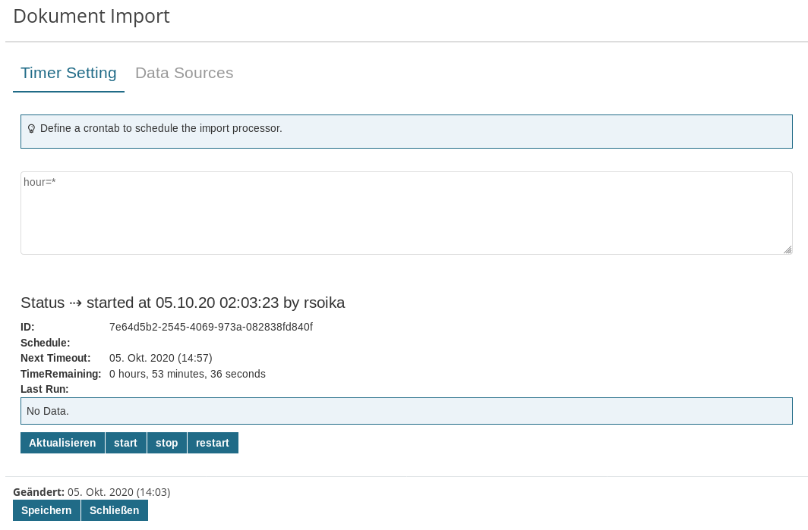

# Imixs-Data-Importer

The Imixs-Data Importer module provides a generic import service to be used to import documents form various external sources (document source) like a FTP server or a IMAP account.

The Importer service is based on the Imixs-Scheduler API to perform imports on a scheduled base. The scheduler sends CDI events which can be consumed specific importer implementations. In this way the Importer service is highly extensible. The following import sources are supported:

- FTP - import form a ftp server
- IMAP - import form an email box via IMAP

# Scheduling

The implementation of the Imixs _DocumentImportScheduler_ is based on the EJB 3.1 Timer Service specification. The syntax takes its roots from the Unix cron utility to be configured. The following shows an example to run the scheduler all 15 minutes

    minute=*/15
    hour=*

## The Document Source Object

Each external document source is represented by a so called _document source object_. The _document source object_ provides at least the following properties used by a CDI observer implementation to access the data source and to create a new workflow instance:

- _server_ - server address of the document source including a host name and a protocol
- _port_ - an optional server port
- _user_ - optional user id to access the server
- _password_
- _task_ - the BPMN task ID a new workitem is assigned to
- _event_ - the BPMN event ID a new workitem is processed
- _workflowgroup_ - the workflow group the new workitem should be assigned to
- _modelversion_ - optional modelversion the new workitem is assigend to
- _selector_ - an optional selector to specify the source (e.g. a path on a FTP server)

### The Document Source Options

A _document source object_ can provide additional options in the item '_options_'. The _DocumentImportService_ provides a convenient method to get a Properties object for all options. In this way a concrete Document Source implementation can access the options:

    // get properties form source object
    Properties properties = documentImportService.getOptionsProperties(ItemCollection source);

## The Web UI

The Importer adapter provides a JSF Web UI component to be used for jsf applications. This ui component is optional and can be implemented also in a customized way.



### The DocumentImportController

The CDI Bean _DocumentImportController_ is used to display and select data sources. The controller can be extend for individual source definitions.


# Importer Services

The Imixs-Data-Importer can be extended by various Import Services. This is a flexible mechanism based on CDI events to adapt the import of Workitems form different sources.

The following Standard Importer Services are available in the current implementation:

- [Mail IMAP Importer](MAIL_IMPORTER.md) - imports documents from a Mail Box using IMAP
- [FTP Importer](FTP_IMPORTER.md) - imports documents form a FTP server
- [CSV Importer](CSV_IMPORTER.md) - imports documents form a CSV file located on a FTP server

## Implementation of a Custom Import Service

An Importer Service Implementation is a CDI bean that at least implements an observer method for the CDI event `DocumentImportEvent`. This event provides the configuration details of the data source. The method should set the DocumentImportEvent.PROCESSING_COMPLETED in case the import was completed successful.

```java
@Named
public class CSVImportService {
    @Inject
    UpdateService indexUpdateService;

    @Inject
    DocumentImportService documentImportService;

    /**
     * This method reacts on a CDI ImportEvent and imports the data from a specific source
     */
    public void onEvent(@Observes DocumentImportEvent event) {
        ..........
        try {
            String ftpServer = event.getSource().getItemValueString(DocumentImportService.SOURCE_ITEM_SERVER);
            String ftpPort = event.getSource().getItemValueString(DocumentImportService.SOURCE_ITEM_PORT);
            String ftpUser = event.getSource().getItemValueString(DocumentImportService.SOURCE_ITEM_USER);
            String ftpPassword = event.getSource().getItemValueString(DocumentImportService.SOURCE_ITEM_PASSWORD);
            String csvSelector = event.getSource().getItemValueString(DocumentImportService.SOURCE_ITEM_SELECTOR);
            Properties sourceOptions = documentImportService.getOptionsProperties(event.getSource());
            ....
            ..............
            .................

        } catch (IOException e) {
            logger.severe("I/O Error: " + e.getMessage());
            documentImportService.logMessage("...import failed (replyCode=" + r + ") : " + e.getMessage(),
                    event);
            event.setResult(DocumentImportEvent.PROCESSING_ERROR);
            return;
        } finally {
        }

        // flush index...
        indexUpdateService.updateIndex();
        // completed
        event.setResult(DocumentImportEvent.PROCESSING_COMPLETED);

    }

}
```
