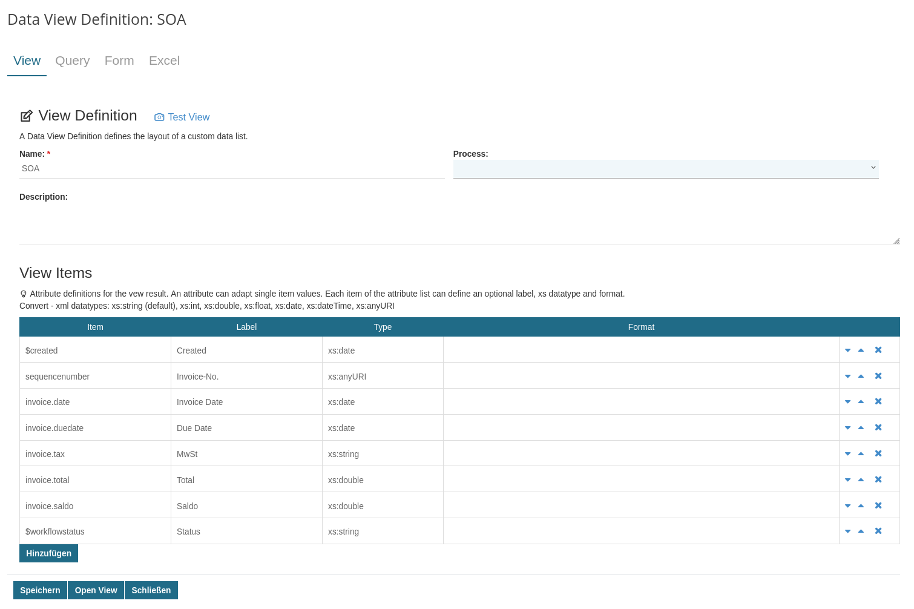
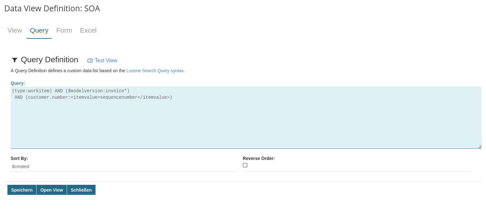
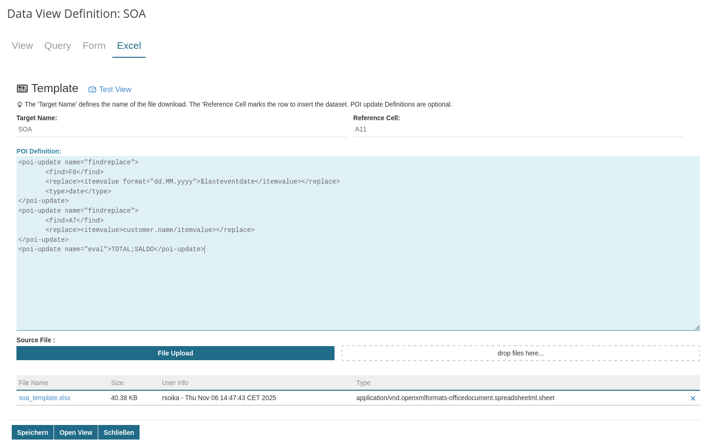

# Imixs-Data View

An Imixs Data View presents workitems in a list. The data view definition describes the selector as well as the columns and their contents.



The selector can either be a lucene query or a reference to a [Imixs Data Group](../imixs-data-groups/README.md).



You can also define a export into a POI Format:



## Export a Data View

Data Views can also be computed and exported into a file during the processing-cycle. For this the signal adapter
`org.imixs.workflow.datagroup.DataGroupExportAdapter` can be called.

**Example:**

```xml
<imixs-data-group name="EXPORT">
    <type>CSV|POI</type>
    <dataview>invoices</dataview>
    <targetname>my-export.csv</targetname>
   <debug>true</debug>
</imixs-data-group>
```

Find details about how to export a dataview in the [Imixs-Data-Groups Project](https://github.com/imixs/imixs-data/tree/main/imixs-data-groups) .
